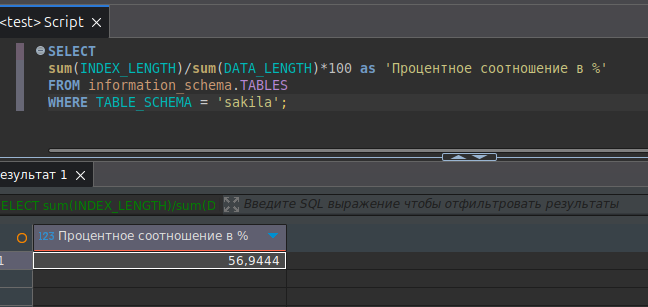

# Домашнее задание к занятию «Индексы»

### Задание 1

Напишите запрос к учебной базе данных, который вернёт процентное отношение общего размера всех индексов к общему размеру всех таблиц.

### Ответ



### Задание 2

Выполните explain analyze следующего запроса:
```sql
select distinct concat(c.last_name, ' ', c.first_name), sum(p.amount) over (partition by c.customer_id, f.title)
from payment p, rental r, customer c, inventory i, film f
where date(p.payment_date) = '2005-07-30' and p.payment_date = r.rental_date and r.customer_id = c.customer_id and i.inventory_id = r.inventory_id
```
- перечислите узкие места;
- оптимизируйте запрос: внесите корректировки по использованию операторов, при необходимости добавьте индексы.

### Ответ

explain analyze запроса выше
```
-> Table scan on <temporary>  (cost=2.5..2.5 rows=0) (actual time=3105..3105 rows=391 loops=1)
    -> Temporary table with deduplication  (cost=0..0 rows=0) (actual time=3105..3105 rows=391 loops=1)
        -> Window aggregate with buffering: sum(payment.amount) OVER (PARTITION BY c.customer_id,f.title )   (actual time=1360..2993 rows=642000 loops=1)
            -> Sort: c.customer_id, f.title  (actual time=1360..1393 rows=642000 loops=1)
                -> Stream results  (cost=10.7e+6 rows=16.5e+6) (actual time=0.398..993 rows=642000 loops=1)
                    -> Nested loop inner join  (cost=10.7e+6 rows=16.5e+6) (actual time=0.395..855 rows=642000 loops=1)
                        -> Nested loop inner join  (cost=9.08e+6 rows=16.5e+6) (actual time=0.392..731 rows=642000 loops=1)
                            -> Nested loop inner join  (cost=7.43e+6 rows=16.5e+6) (actual time=0.388..600 rows=642000 loops=1)
                                -> Inner hash join (no condition)  (cost=1.65e+6 rows=16.5e+6) (actual time=0.38..21.6 rows=634000 loops=1)
                                    -> Filter: (cast(p.payment_date as date) = '2005-07-30')  (cost=1.72 rows=16500) (actual time=0.166..2.88 rows=634 loops=1)
                                        -> Table scan on p  (cost=1.72 rows=16500) (actual time=0.159..2.11 rows=16044 loops=1)
                                    -> Hash
                                        -> Covering index scan on f using idx_title  (cost=103 rows=1000) (actual time=0.026..0.159 rows=1000 loops=1)
                                -> Covering index lookup on r using rental_date (rental_date=p.payment_date)  (cost=0.25 rows=1) (actual time=563e-6..804e-6 rows=1.01 loops=634000)
                            -> Single-row index lookup on c using PRIMARY (customer_id=r.customer_id)  (cost=250e-6 rows=1) (actual time=80.7e-6..100e-6 rows=1 loops=642000)
                        -> Single-row covering index lookup on i using PRIMARY (inventory_id=r.inventory_id)  (cost=250e-6 rows=1) (actual time=69.5e-6..88.8e-6 rows=1 loops=642000)

```
- узкие места
    - условие выборки по датам, там приходится прочитывать полностью таблицу
    - лишнее использование таблицы film, из за нее распухает колличество данных в выборках и цена запроса
    - смущает в запросе p.payment_date = r.rental_date, поменял бы на p.rental_id = r.rental_id

- оптимизируйте запрос
    - добавлен индекс и изменено условие выборки ( create index payment_data on payment(payment_date); )
    - убрано использование таблицы film
    - переписаны с использованием join для удобного чтения 

#### оптимизированный запрос и explain analyze
```sql
select 
distinct 
		concat(c.last_name, ' ', c.first_name), 
		sum(p.amount) over (partition by c.customer_id)
from payment p 
join rental r on p.payment_date = r.rental_date
join customer c on r.customer_id = c.customer_id
join inventory i on i.inventory_id = r.inventory_id
where 
	p.payment_date between '2005-07-30' and adddate('2005-07-30',interval 1 day);
```
```
-> Table scan on <temporary>  (cost=2.5..2.5 rows=0) (actual time=3.49..3.53 rows=391 loops=1)
    -> Temporary table with deduplication  (cost=0..0 rows=0) (actual time=3.49..3.49 rows=391 loops=1)
        -> Window aggregate with buffering: sum(payment.amount) OVER (PARTITION BY c.customer_id )   (actual time=2.7..3.36 rows=642 loops=1)
            -> Sort: c.customer_id  (actual time=2.69..2.72 rows=642 loops=1)
                -> Stream results  (cost=805 rows=661) (actual time=0.0717..2.58 rows=642 loops=1)
                    -> Nested loop inner join  (cost=805 rows=661) (actual time=0.0689..2.44 rows=642 loops=1)
                        -> Nested loop inner join  (cost=581 rows=661) (actual time=0.0662..1.93 rows=642 loops=1)
                            -> Nested loop inner join  (cost=349 rows=634) (actual time=0.0578..0.832 rows=634 loops=1)
                                -> Filter: (r.rental_date between '2005-07-30' and <cache>(('2005-07-30' + interval 1 day)))  (cost=127 rows=634) (actual time=0.0516..0.3 rows=634 loops=1)
                                    -> Covering index range scan on r using rental_date over ('2005-07-30 00:00:00' <= rental_date <= '2005-07-31 00:00:00')  (cost=127 rows=634) (actual time=0.0488..0.138 rows=634 loops=1)
                                -> Single-row index lookup on c using PRIMARY (customer_id=r.customer_id)  (cost=0.25 rows=1) (actual time=695e-6..718e-6 rows=1 loops=634)
                            -> Index lookup on p using payment_data (payment_date=r.rental_date)  (cost=0.261 rows=1.04) (actual time=0.00134..0.00162 rows=1.01 loops=634)
                        -> Single-row covering index lookup on i using PRIMARY (inventory_id=r.inventory_id)  (cost=0.24 rows=1) (actual time=639e-6..661e-6 rows=1 loops=642)

```